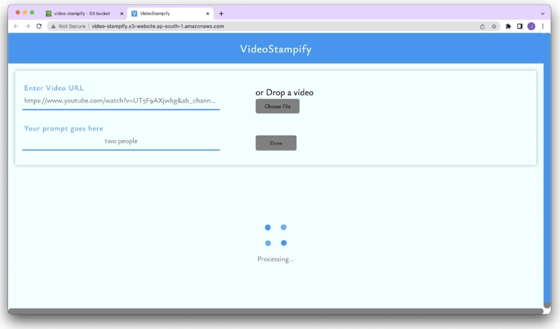
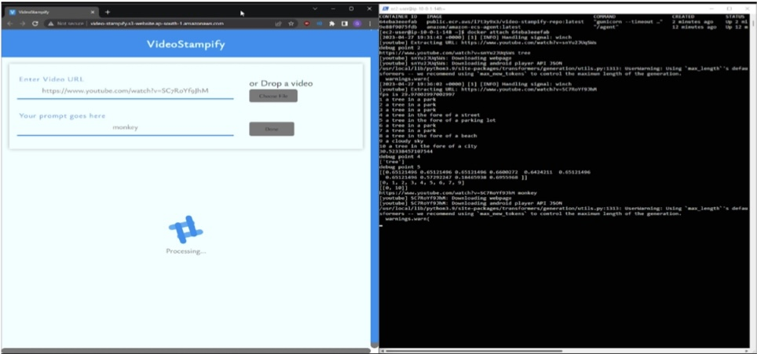
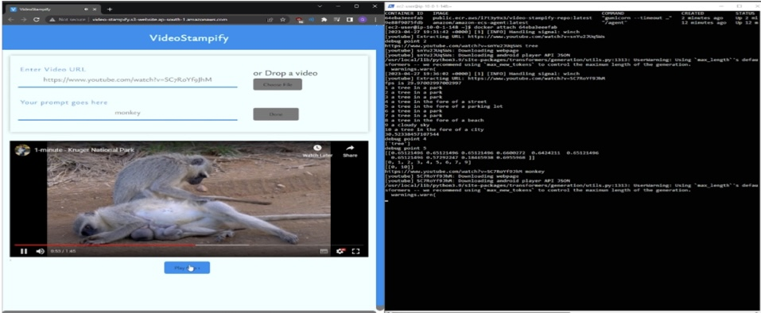

# VideoStampify

**Prompt-Based Video Navigation** Project: This tool allows users to input a video link along with a specific prompt describing what they’re looking for in the video. The system analyzes the video and generates corresponding playable clips with timestamps based on the prompt. This feature enhances user experience by enabling efficient navigation through the video content, saving time, and focusing on relevant sections without manually searching.

- Primary focus was to deploy frontend and backend on AWS using best practices and related services.
- Images of working project (Apologies for blurred shots)
  - Providing prompt to find monkey in clip with clip URL 
    
      
    
  - Backend processing the request 
    
      
    
  - Result:  
    
      
