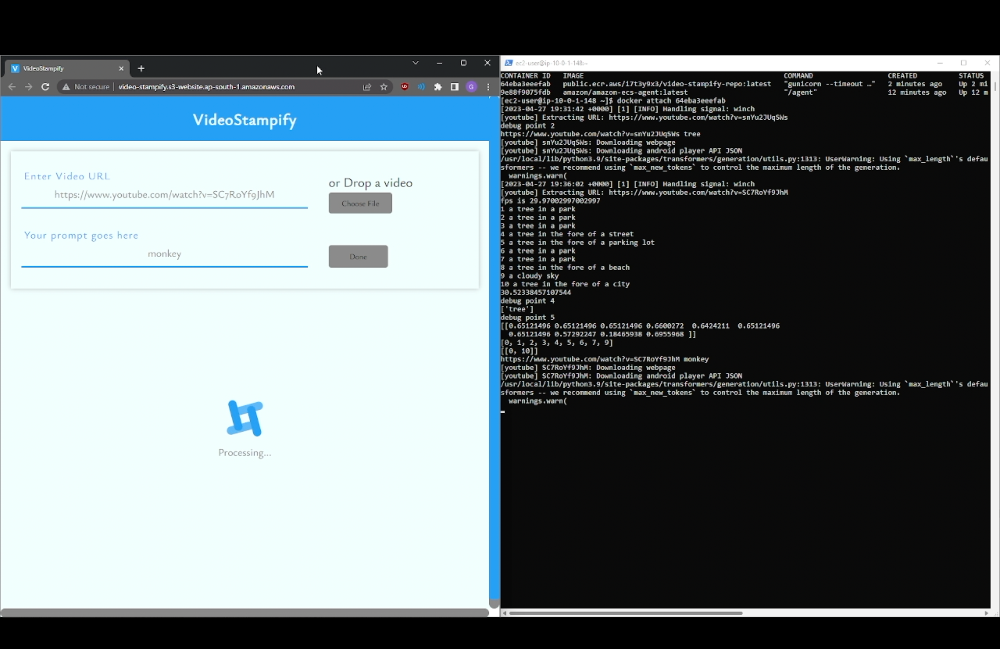

# VideoStampify

**Prompt-Based Video Navigation** Project

This tool allows users to input a video link along with a specific prompt describing what they’re looking for in the video. The system analyzes the video and generates corresponding playable clips with timestamps based on the prompt. This feature enhances user experience by enabling efficient navigation through the video content, saving time, and focusing on relevant sections without manually searching.

- Check demo here - [Demo](https://youtu.be/gHWRcPCQx8s)
- Primary focus was to deploy frontend and backend on AWS with related services using best practices
- Providing prompt to find `monkey` in clip with video URL 
    
    
    
- Result
    
    
